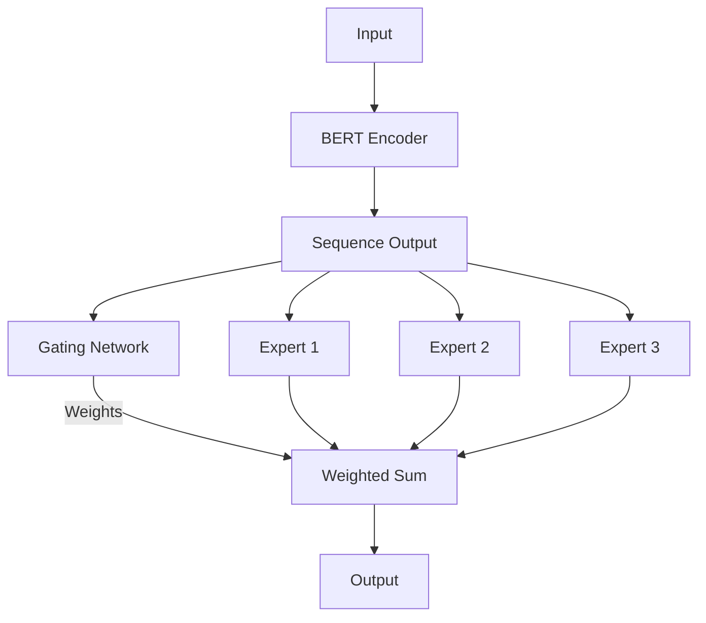
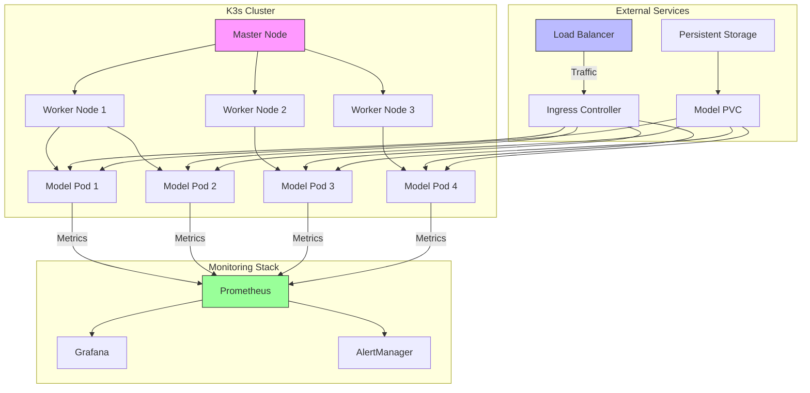
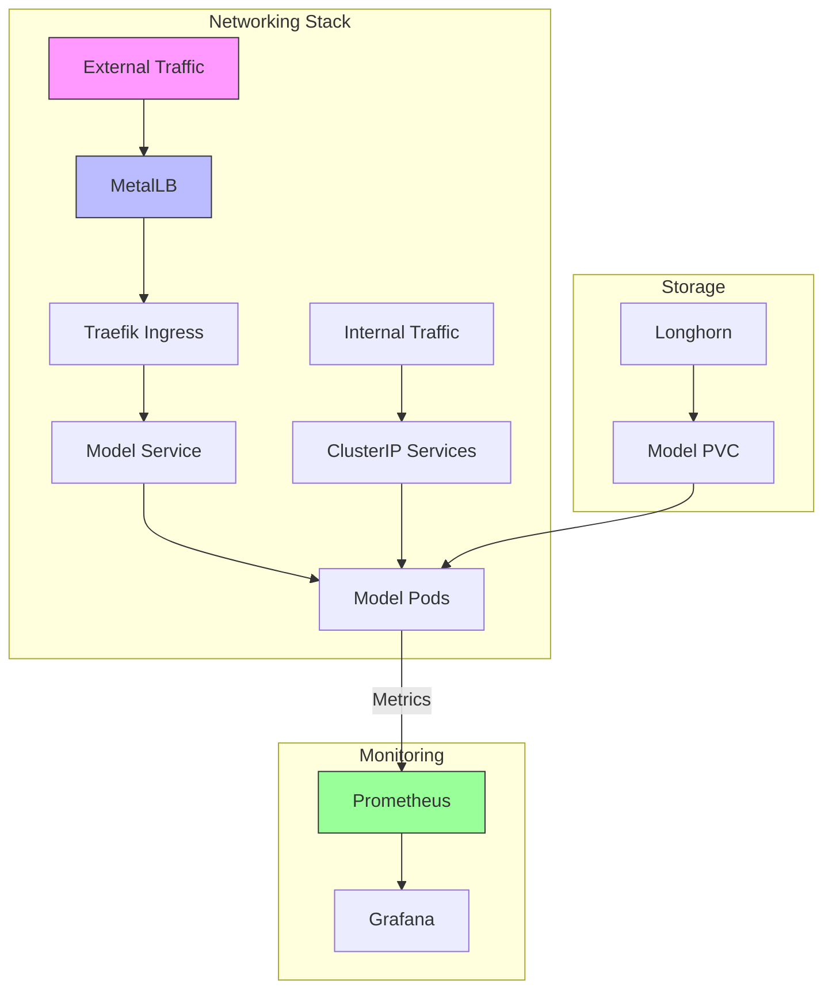
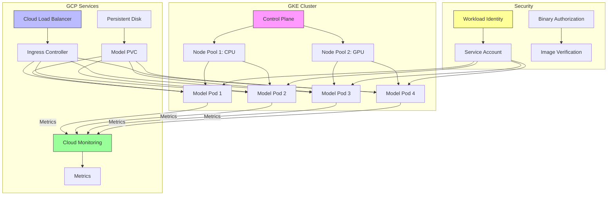
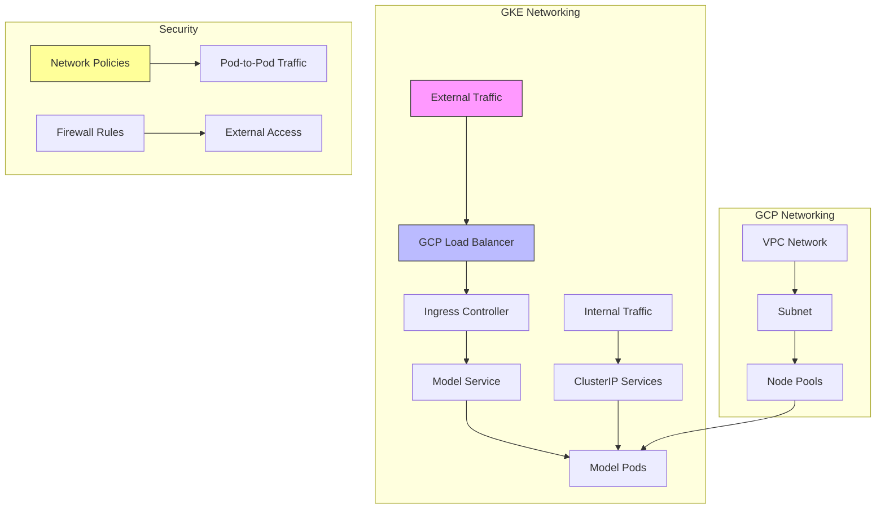

# pytorch_moe_bert
## PyTorch Mixture of Experts (MOE) Model with BERT Scale

---

### Key Features :spiral_notepad:

**1. BERT Scale Architecture**

- Uses BERT's transformer architecture as the base
- Configurable hidden size (768 by default)
- Multiple attention heads (12 by default)

**2. Mixture of Experts**

- 8 experts by default (configurable)
- Each expert is a 2-layer feed-forward network
- Top-2 routing by default (configurable)
- Noisy gating mechanism for better training stability

**3. ONNX Export:**

- Includes example code to export the model to ONNX format
- Handles dynamic axes for varible sequence lengths

**4. Training Considerations**

- Proper weight initialization
- Dropout for regularization
- GELU activations

**Notes** :notebook:
    
> For production serving, you may want to add:
- Batch processing support
- Proper tokenization handling
- Pre/post processing steps

> The model assumes a classification task
> Model can be scaled up by increasing the number of layers, experts, or hidden dimensions

### Model Serving: Kubernetes (k3s) :cloud:

__K3s Production Architecture__

__Components__:

- Master Node: Runs control plane components (API server, scheduler, controller manager)
- Worker Nodes: Run the model pods and other workloads.
- Load Balancer: Distributes traffic to ingress controller.
- Ingress Controller: Routes external traffic to model pods.
- Persistent Storage: Provides shared storage for model files.
- Monitoring Stack: Collects metrics from modal pods.

__Detailed K3s Networking__

__Components__:

- MetalLB: Provides LoadBalancer services in bare-metal k3s
- Traefik Ingress: Handles external HTTP/HTTPS traffic
- ClusterIP Services: Internal service discovery
- Longhorn: Distributed block storage for persistent volumes
- Prometheus/Grafana: Monitoring stack

### Model Serving: Kubernetes (GKE) :cloud:

__GKE Production Architecture__

__Components__:

- Control Plane: Managed by GCP (highly available)
> Node Pools:
- CPU pool for general workloads
- GPU pool for model serving

- Cloud Load Balancer: GCP-managed ingress
- Persistent Disk: GCP-native monitoring solution
- Workload Identity: Secure access to GCP services
- Binary Authorization: Image verification for security

__Detailed GKE Networking__

__Components__:

- GCP Load Balancer: Global HTTP/S load balancer
- Ingress Controller: GKE-managed ingress
- VPC Network: GCP Virtual Private Cloud
- Network Policies: Kubernetes-native network segmentation
- Firewall Rules: GCP firewall for additional security

