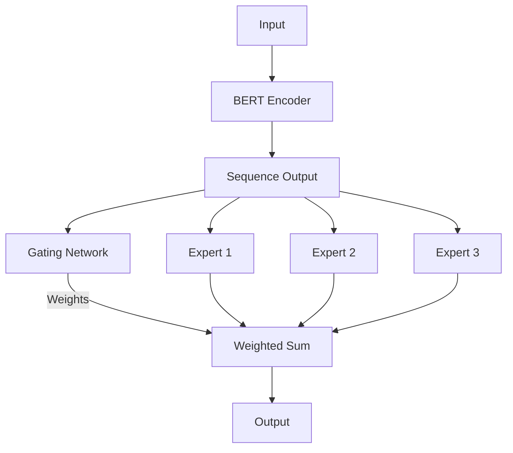

# pytorch_moe_bert
## PyTorch Mixture of Experts (MOE) Model with BERT Scale

---

### Key Features :spiral_notepad:

**1. BERT Scale Architecture**

- Uses BERT's transformer architecture as the base
- Configurable hidden size (768 by default)
- Multiple attention heads (12 by default)

**2. Mixture of Experts**

- 8 experts by default (configurable)
- Each expert is a 2-layer feed-forward network
- Top-2 routing by default (configurable)
- Noisy gating mechanism for better training stability

**3. ONNX Export:**

- Includes example code to export the model to ONNX format
- Handles dynamic axes for varible sequence lengths

**4. Training Considerations**

- Proper weight initialization
- Dropout for regularization
- GELU activations

**Notes** :notebook:
    
> For production serving, you may want to add:
- Batch processing support
- Proper tokenization handling
- Pre/post processing steps

> The model assumes a classification task
> Model can be scaled up by increasing the number of layers, experts, or hidden dimensions

### Model Serving: Kubernetes (k3s) :cloud:

### Model Serving: Kubernetes (k3s) :cloud:

